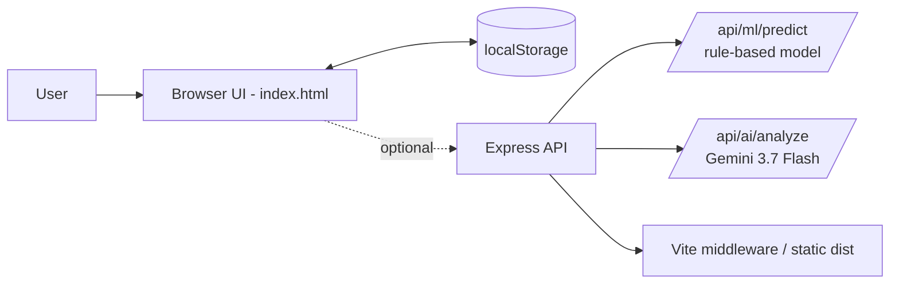

# 🧠 MindBalance

**Behavioral & Lifestyle Analytics Platform**

Explainable wellbeing signals, priority-driven action plans, and habit simulation — built for self-awareness, not diagnosis.

---

## 📖 Overview

**MindBalance** is a behavioral analytics dashboard that turns daily lifestyle inputs — sleep, screen time, physical activity, focused work, and perceived stress — into a transparent **Wellbeing Signal**, a ranked list of friction points, and a concrete action plan. Every score is explainable: users can see exactly which habit moved the number, and by how much.

It is built as a **rule-based analytics engine**, not a black-box model — every score decomposes into visible, weighted contributions from each logged habit.

---

## 🎯 Problem Statement

Most habit trackers stop at logging data. They show *what* happened but rarely explain:

- Why does today's score look the way it does?
- Which single habit is doing the most damage right now?
- What should I change first, and how much will it actually help?
- Am I trending better or worse over time?

Raw numbers without attribution or prioritization don't drive behavior change.

## 💡 Solution

MindBalance closes that gap with a **transparent scoring pipeline**:

1. Log daily lifestyle metrics (sleep, screen time, activity, study, stress)
2. A deterministic weighted model converts them into a single **Wellbeing Signal (1–10)**
3. Every contributing factor is shown with its exact delta (`+0.9`, `-0.6`, etc.)
4. Issues are auto-ranked into **High / Medium priority** with a specific recommended action
5. A **What-If Simulator** lets users preview the score impact of a habit change *before* committing to it

---

## ✨ Key Features

| Feature | Description |
|---|---|
| **Wellbeing Signal** | Single 1–10 score computed from sleep, screen time, activity, study balance, and stress |
| **Explainable Attribution** | "Why This Score?" panel breaks the total into per-factor positive/negative deltas |
| **Priority Action Hierarchy** | Auto-generated High/Medium/Good-standing issues, each with a concrete next action |
| **Daily Tracking Log** | Structured daily entry form (mood, sleep, screen, activity, stress, notes) with editable history |
| **Pattern Detection** | Lightweight correlation checks across logged history (e.g. low sleep ↔ high stress days) |
| **Progress & Trends** | 7-day trend chart (custom SVG) with rolling averages per metric |
| **Skills Growth Matrix** | Track current vs. target level across personal skill areas, with an auto-selected priority roadmap |
| **What-If Simulator** | Live projection of score change from hypothetical sleep/screen/activity adjustments |
| **Executive Report** | Printable summary view (score, top concern, trend, recommendations) via browser print-to-PDF |
| **Dark / Light Theme** | Persisted theme toggle |
| **Local-First Privacy** | All data stored in browser `localStorage`; JSON export and full data reset available |
| **Optional AI Narrative** | Server-side Gemini integration for a generated, coaching-style written report |

---

## ⚙️ How the System Works

MindBalance runs on **two complementary analytics layers**:

**1. Client-side scoring engine** (`index.html`)
A self-contained JavaScript engine computes the Wellbeing Signal instantly in the browser, with no network dependency:
- `computeWellbeingScore()` — deterministic weighted-delta model
- `evaluatePriorities()` — rule-based issue/strength classification
- `analyzePatterns()` — basic frequency/correlation checks over logged history

**2. Server-side analytics API** (`server.ts`)
An Express backend exposes two additional endpoints for extended analysis:
- `POST /api/ml/predict` — a statistical, logistic-function-based fatigue risk and persona-clustering model with per-feature impact breakdown
- `POST /api/ai/analyze` — sends the lifestyle profile + model output to **Gemini (`gemini-3.7-flash`)** for a written, coaching-style narrative report; falls back to a templated local summary if no API key is configured

---

## 🏗️ Architecture

- **Dev mode:** Express runs Vite in middleware mode for HMR-enabled serving
- **Prod mode:** `vite build` produces static assets; `server.ts` is bundled via `esbuild` to `dist/server.cjs` and serves the compiled SPA

---

## 🛠️ Tech Stack

| Layer | Technology |
|---|---|
| Frontend | React 19, TypeScript, Vite 6, TailwindCSS 4, `lucide-react`, `motion` |
| Backend | Node.js, Express 4, `tsx` (dev runner), `esbuild` (prod bundling) |
| AI Integration | `@google/genai` — Gemini `gemini-3.7-flash` (optional, server-side only) |
| Data Layer | Browser `localStorage` — no external database |
| Tooling | TypeScript (`tsc --noEmit` for type-checking), dotenv |

---

## 🧮 Scoring Methodology

The Wellbeing Signal starts from a **baseline of 6.0** and applies weighted deltas per factor:

| Factor | Rule |
|---|---|
| **Sleep** | +0.9 within 7.5–9h optimal band; penalty scales with deficit below 7.5h |
| **Screen Time** | +0.7 at ≤3h; penalty scales up beyond 3h, steeper past 5h |
| **Physical Activity** | +0.6 at ≥1.5h; +0.2 at ≥0.5h; −0.4 below that |
| **Study / Deep Work** | +0.3 within a 3–6h balanced range; small penalty if too low |
| **Perceived Stress** | +0.6 (Low) / 0.0 (Medium) / −0.9 (High) |

Final score is clamped to a 1.0–10.0 range. The server-side `/api/ml/predict` route applies a separate **logistic-style fatigue risk function** combined with rule-based persona clustering (e.g. *"Digital Strain & Sleep Deficit"*, *"Peak Cognitive Flow"*) driven by the same underlying inputs.

> Both models are **transparent, weight-based statistical rules**--not machine-learning models trained on external datasets — by design, so every output stays explainable.

---

